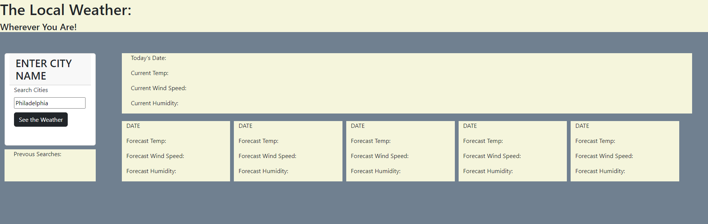

# api-weather-dashboard

## Description

This project tested my skills with API calls, requiring two different API fetch functions to pull off. It first pulls the geographical data for cities across the world, and then performs a second API call to get the weather data needed for that location. As a result you can summarize loads of API data by providing nothing more than a city name.

I tried to keep the code as separated by function as possible in order to make it usable in the future, and tried to avoid code that would only work with these specific API calls and subject matter. In future API uses, I'll be able to lean heavily on this code regardless if weather forecasts are involved or not.

I am still not happy with how wordy the code is to populate the info on the future-day forecast, and will keep working to simplify that function as much as possible. But the code is still extremely versatile, and can be expanded into even more details with simple copy/pasting and some data name tweaks. 

## Usage

Upon loading the [Weather Dashboard](https://collylee.github.io/api-weather-dashboard/), you will have a blank forecast and a search bar on the left. Search for any city by name, and either hit the "See the Weather" button or press ENTER. The five day forecast will show the current weather, and the weather over the next few days. 

The cities you searched for will be saved to the cache, and available as buttons on the left hand side on your next visit. Click on the button to bring the weather for that city back up.

## Credits

Thank you to Ben Martin for helping me with the API calls during a tutoring session. He helped me to connect the last few dots to get the forecast data I needed.